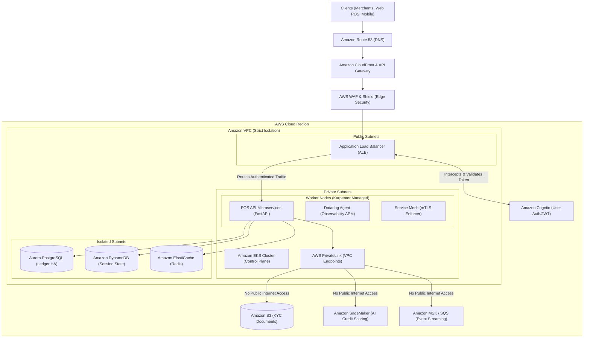

# Sunbit Infrastructure Architecture Proposal (AWS & Kubernetes)

As a candidate for the DevOps Manager role at Sunbit, presenting a robust, scalable, and secure infrastructure is critical. Sunbit provides AI insights for instant online credit, particularly for high-value transactions like car purchases and dental services in the US. This requires an architecture that is not only highly available and performant but also strictly compliant with financial (PCI-DSS) and healthcare/PII regulations.

Below is a comprehensive proposal for the required AWS services and Kubernetes infrastructure to support this platform.

---

## 1. Core Principles
- **Security & Compliance First**: Strict data isolation, encryption at rest/in transit, and zero-trust networking to protect sensitive PII and financial data.
- **High Availability (HA) & Disaster Recovery**: Multi-AZ deployments with automated failover and regular, tested backups.
- **Scalability**: Instant scaling to handle burst traffic during peak shopping hours or high-volume auto/dental financing requests.
- **Observability**: Deep visibility into microservices to ensure rapid incident response and strict SLAs.

---

## 2. Infrastructure as Code (IaC) & Progressive Delivery
- **Layered Terraform Provisioning**: To decouple state from compute, the infrastructure is provisioned in isolated code layers (`01-network`, `02-data`, `03-eks`). This prevents accidental deletion of stateful databases when updating Kubernetes nodes.
- **GitOps with ArgoCD**: Kubernetes manifests and Helm charts are managed via GitOps. Pull Requests merged to the main branch automatically reconcile in the EKS clusters.
- **Progressive Delivery (Argo Rollouts)**: To prevent massive blast radiuses during deployment (crucial for BNPL transaction systems), we utilize Canary deployments. Argo routes 20% of traffic to the new version, pausing for metric validations before a full rollout.

---

## 3. Architecture Visualization

---

## 4. AWS Services Breakdown

### Networking & Secure Edge
- **Amazon Route 53**: Highly available DNS management for routing user requests (from merchants, POS systems, web portals) to the application.
- **Amazon Cognito (Edge Authentication)**: The EKS Application Load Balancer natively integrates with Cognito via standard Ingress annotations. The ALB intercepts HTTP requests, validates the Cognito JWT token, and only forwards properly authenticated users to the backend Kubernetes pods. Unauthenticated users are sent to the Cognito Hosted UI login screen.
- **Amazon CloudFront / API Gateway**: Accelerates and secures edge API traffic.
- **AWS WAF & Shield**: Web Application Firewall to block SQL injection, XSS, and bot traffic.
- **Amazon VPC with Strict Isolation**:
  - **Public Subnets**: strictly for NAT and ALBs.
  - **Private Subnets**: For EKS worker nodes.
  - **AWS PrivateLink (VPC Endpoints)**: Ensures that when the EKS Cluster communicates with AWS services (like SageMaker or DynamoDB), traffic strictly traverses the private AWS backbone and *never* hits the public internet.

### Compute & Orchestration (The Kubernetes Layer)
- **Amazon EKS (Elastic Kubernetes Service)**: The core container orchestration platform running the microservices.
  - **Karpenter**: Highly efficient, intent-based cluster autoscaler that provisions the right-sized EC2 nodes in seconds based on pending pod requirements.
- **AWS Load Balancer Controller**: Dynamically provisions ALBs for ingress traffic routing to Kubernetes services.
- **Service Mesh (Istio / Linkerd)**: 
  - Provides **mTLS** (mutual TLS) between all microservices to ensure data in transit within the cluster is fully encrypted.
  - Enables advanced traffic routing strategies like Blue-Green and Canary deployments.

### Data & State Layer
- **Amazon Aurora PostgreSQL**: High-performance, highly available relational database for storing transactional data (user profiles, loan ledgers, payment schedules). Multi-AZ deployment with Read Replicas for scaling read-heavy query loads.
- **Amazon DynamoDB**: Fast, managed NoSQL database for rapid lookups, user session states, and acting as a feature store for the AI engine.
- **Amazon ElastiCache (Redis)**: In-memory caching to speed up read access for frequently accessed data, reducing load on Aurora.
- **Amazon S3**: Secure object storage for uploading and storing KYC documentation (IDs, dental invoices). Configured with strict IAM policies and Object Lock for compliance.

### Event Streaming & Async Processing
- **Amazon MSK (Managed Streaming for Apache Kafka) / Amazon EventBridge**: Acts as the central nervous system for the BNPL platform. In a financial/AI architecture, it serves three mandatory purposes:
  1. **Asynchronous Decoupling (Resilience)**: Real-time ML scoring or intense ledger updates can cause HTTP timeouts if done synchronously. Instead, the API instantly queues an `ApplicationReceived` event to MSK and immediately responds to the merchant's POS system. If the SageMaker endpoint or secondary databases experience temporary outages, no customer applications are dropped—they safely queue in Kafka until the services recover.
  2. **Immutable Audit Ledger (Compliance)**: Financial regulators require proof of *why* and *when* credit was issued. Every state change (e.g., `Submitted`, `RiskScored`, `Approved`, `Funded`) is appended to MSK as an immutable event log, preventing tampering.
  3. **Data Pipeline for ML (SageMaker)**: AI risk models require continuous feedback to remain accurate. MSK streams all raw POS transaction events (and eventual loan default data) directly into an S3 Data Lake (often via Kinesis Firehose). The Data Science teams use this historical stream to retrain and deploy better SageMaker models without ever touching or impacting the live API production databases.

### AI & Insights
- **Amazon SageMaker**: Since Sunbit relies on AI insights for instant credit limits, SageMaker is used to build, train, and deploy machine learning models. Microservices running in EKS communicate with SageMaker endpoints via internal VPC routing for real-time credit scoring (millisecond latency).

### Security & Governance
- **AWS IAM with IRSA (IAM Roles for Service Accounts)**: Grants specific Kubernetes Pods least-privilege access to AWS APIs (e.g., an S3 uploader pod only gets access to write to a specific S3 bucket).
- **AWS KMS (Key Management Service)**: Manages encryption keys used to encrypt all data at rest across EBS, S3, Aurora, and DynamoDB.
- **AWS Secrets Manager**: Securely stores database passwords, API keys, and third-party integration credentials. Kubernetes External Secrets Operator synchronizes these into the cluster.
- **Amazon Macie / GuardDuty**: Macie continuously scans S3 for unencrypted PII. GuardDuty provides intelligent threat detection across the AWS account.

### Observability & APM (Datadog)
- **Datadog Agent & APM**: Replaces native AWS metric collection. Deployed as a DaemonSet across the EKS cluster.
- **Unified Service Tagging**: Every microservice and infrastructure layer uses standard Datadog tags (`env`, `service`, `version`) to correlate traces, logs, and infrastructure metrics.
- **Python `ddtrace`**: The FastAPI POS microservice is horizontally instrumented with the Datadog APM tracing library, providing highly detailed latency breakdowns and error tracking per request.
- **Network Performance Monitoring (NPM)**: Monitors deep network traffic between pods, nodes, and PrivateLink endpoints.

---

## 6. Disaster Recovery Plan (DRP)

For a financial services platform, a localized outage (e.g., an entire AWS Region going down) must not result in prolonged downtime or data loss. The proposed DRP utilizes a **Warm Standby (Active-Passive) Multi-Region Architecture**:

### RTO (Recovery Time Objective) and RPO (Recovery Point Objective)
- **Target RPO**: < 1 second for transactional data.
- **Target RTO**: < 15 minutes to fully handle traffic in the secondary region.

### Data Replication (The State)
- **Aurora Global Database**: The PostgreSQL ledger is configured as a Global Database. Data written to the primary region (`us-east-1`) is asynchronously replicated to the secondary region (`us-west-2`) with typical latency of < 1 second.
- **DynamoDB Global Tables**: Session states and AI feature stores are replicated continuously across regions.
- **Amazon S3 Cross-Region Replication (CRR)**: KYC documents and invoices are automatically copied to the secondary region's bucket.

### Compute & Routing (The Switch)
- **Standby EKS Cluster**: A scaled-down (Pilot Light/Warm Standby) EKS cluster runs in the secondary region, managed by the exact same GitOps (ArgoCD) repository as the primary.
- **Route 53 Failover Routing**: Route 53 continuously monitors the health of the primary region's ALB. If the health checks fail, DNS traffic is automatically routed to the secondary region's ALB.
- **Failover Execution**:
  1. Route 53 detects primary failure and flips DNS to `us-west-2`.
  2. Aurora Global Database is manually or automatically promoted to Primary in `us-west-2`.
  3. Karpenter in `us-west-2` detects the sudden influx of pending pods and instantly scales up the underlying EC2 compute to meet the traffic demands.
